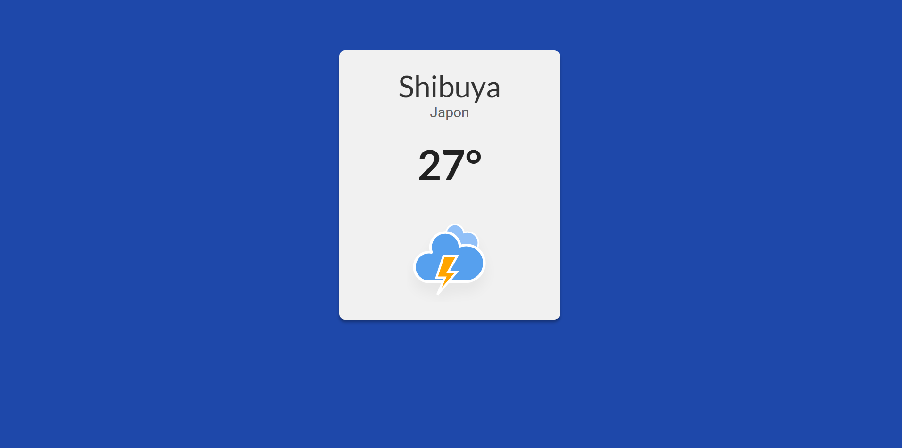

# Weather App

Bienvenue sur le dépôt GitHub de l’application météo.

Ce projet propose une application moderne permettant d’afficher les conditions météorologiques à partir de données stockées localement au format JSON. L’interface utilisateur est développée en JavaScript, offrant une expérience fluide et interactive.

## Aperçu de l’application

Exemple d’interface utilisateur :

## Dépôt GitHub

Accédez au code source complet sur GitHub :  
[https://github.com/Ibrahima96/Simulalion-app-meteo.git](https://github.com/Ibrahima96/Simulalion-app-meteo.git)

## Déploiement Netlify

L’application est disponible en ligne à l’adresse suivante :  
[https://simulation-app-meteo-local.netlify.app](https://simulation-app-meteo-local.netlify.app)

## Fonctionnement technique

L’application exploite la méthode `fetch` de JavaScript pour interroger un fichier JSON local contenant les données météorologiques, qui sont ensuite affichées dynamiquement dans l’interface utilisateur.
